# tdgl3d — 3D Time-Dependent Ginzburg-Landau Simulator

[](https://github.com/omedeiro/nanowire_tdgl/actions/workflows/ci.yml)
[](https://github.com/omedeiro/nanowire_tdgl/actions/workflows/ci.yml)

A Python package for simulating vortex and phase dynamics in three-dimensional
Type-II superconductors using the time-dependent Ginzburg-Landau (TDGL) model
on a structured finite-difference grid.

## Gallery

Every figure is produced by a standalone script in [`docs/figures/`](docs/figures/)
and annotated with the number it is meant to demonstrate. Full descriptions and
the physics behind each one: [`docs/PHYSICS_GALLERY.md`](docs/PHYSICS_GALLERY.md).

### A 3×3 array of 4 µm holes — where lithography sets the size

The coherence length fixes the grid spacing, but fabrication fixes the device,
so a real hole array is a large simulation: nine 4 µm holes on an 8 µm pitch
with an 8 µm buffer is **36 µm across**, and at ξ = 150 nm that is
240 × 240 × 9 — 457 k nodes. At ξ = 100 nm it is 1.8 M, and at ξ = 50 nm,
15 M in 12 GB.

The obvious way to get flux into the holes does not work, and that is the
interesting part. **Ramping the field up, nothing enters until 3.15 mT** — and
just above that, hundreds of vortices enter at once. Held at 3.6 mT, 567 of
them pack the buffer into a triangular lattice while the array stays *fully
Meissner-screened behind them*: the flux front stalls at the array perimeter
and never reaches a hole. There is no applied field at which this film holds
one or two vortices in equilibrium; it holds none, or it holds hundreds.

[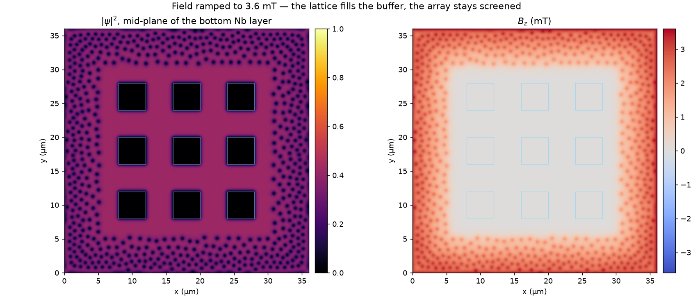](docs/figures/nb_hole_array_entry.png)

**Field-cooling** does what the experiment does. ψ grows from near zero with
the field already on, so flux is trapped where it is rather than having to
cross 8 µm of screening metal; the field then drops below the entry threshold
and the state settles. Cooled at 4.0 mT and held at 2.0 mT, after 400 τ_GL:
**3 vortices in the metal between the holes, 7 flux quanta trapped across the
nine**, with the rest of the flux in the buffer lattice. An independent run of
the same protocol at another noise seed gives 2 and 6, with the census flat
from t = 293 to t = 400 — so this is a settled state, and not one particular
realisation of the noise.

| | |
|:--:|:--:|
| [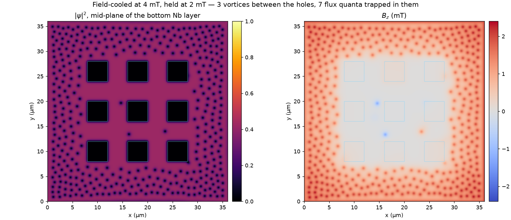](docs/figures/nb_hole_array_trapped.png) | [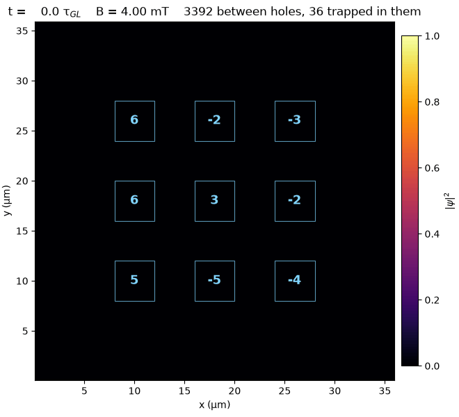](docs/figures/nb_hole_array_trapped.gif) |
| **Remanent state** — the array clears while the holes keep their fluxoid. | **Getting there** — each hole labelled with the fluxoid it holds. |

The holes hold about one quantum each rather than the `B·A/Φ₀ ≈ 19` the applied
field would suggest, and the B_z map says why: 8 µm of buffer at λ = 300 nm
leaves the array interior nearly field-free, so there is no local field there
to support more. **Per-hole occupancy is set by how well the surround screens,
not by the applied field** — which makes the buffer width and κ the levers.

A vortex in the film and a fluxoid in a hole are counted differently, because
they are different things: the first is a core, found from the gauge-invariant
phase winding around a plaquette; the second has no core to find and is read
from the winding on a contour drawn in the metal *around* the hole, which is an
exact integer however little field threads the opening.

Reproduce with [`packages/tdgl3d/examples/nb_hole_array.py`](packages/tdgl3d/examples/nb_hole_array.py),
whose `--dry-run` prints the grid, the memory per frame and a wall-time
estimate before you commit to a run.

### Flux expulsion by an S/I/S ring

A 1 µm hole centred in a 4 µm S/I/S plane with 500 nm layers, at ξ = 100 nm —
Nb near T_c, where Ginzburg-Landau applies. The device expels flux **completely**
— no vortices anywhere, zero fluxoid through the hole — up to **9.2 ± 0.3 mT**.

What limits it is not the hole. A 4 µm plane is 20 λ across and screens so well
that only 1.7% of the applied field reaches the hole (0.07 Φ₀ through it at the
threshold), so the ring is nowhere near its fluxoid limit; vortices penetrate the
1.5 µm-wide arms first, and the hole does not admit a fluxoid until 10.9 mT. The
device therefore beats the naive single-loop estimate Φ₀/A_hole = 2.07 mT by more
than a factor of four.

[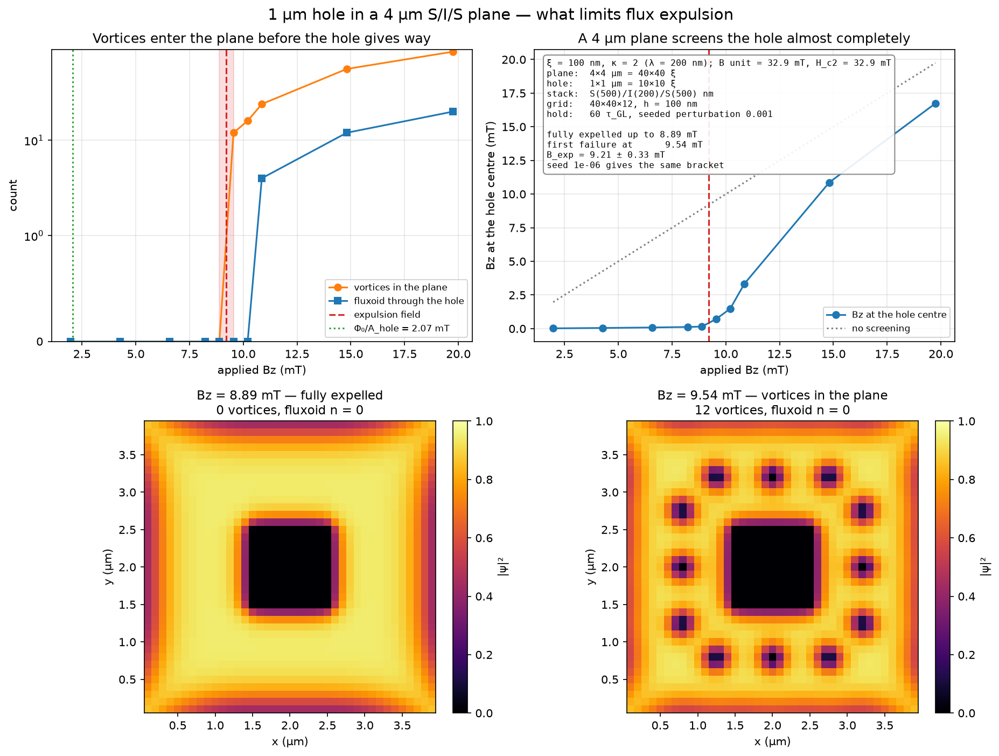](docs/figures/sis_micron_ring.png)

At small scale the mechanism is the other one — the hole itself gives way. For a
4×4 ξ hole with 3 ξ arms the ring holds the fluxoid at zero up to
**B_exp = 0.300 ± 0.020** (in Φ₀/2πξ²), then admits flux in whole quanta, and the
entry time diverges as the threshold is approached from above. Repeating the
bracketing fields at half the grid spacing gives 0.27 ± 0.05 — the threshold
survives refinement.

[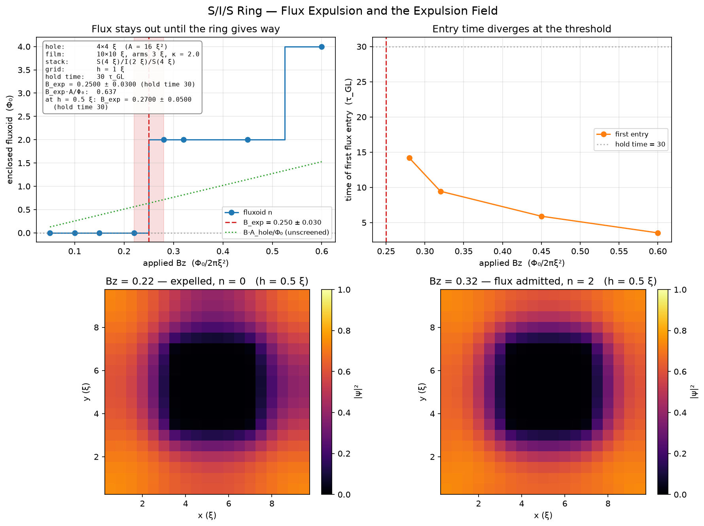](docs/figures/sis_hole_expulsion.png)

| | |
|:--:|:--:|
| [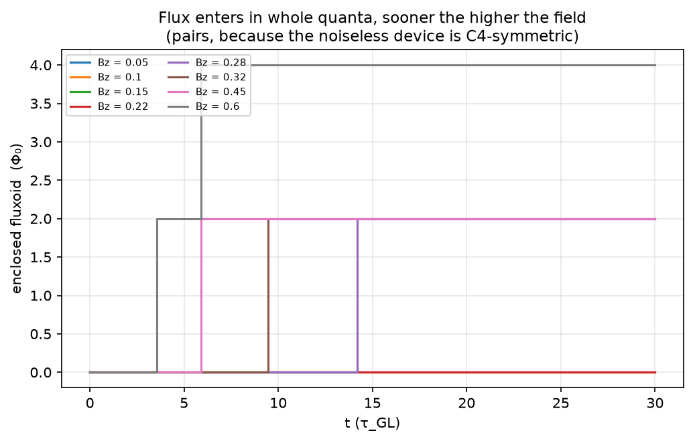](docs/figures/sis_hole_fluxoid_history.png) | [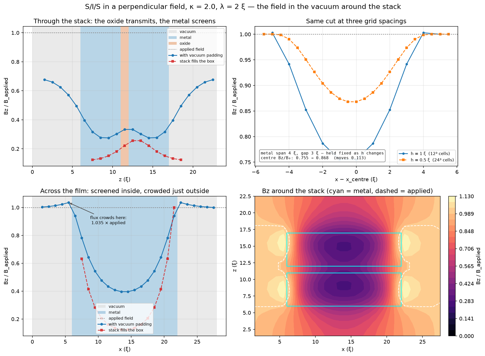](docs/figures/trilayer_bfield.png) |
| **Fluxoid vs time**** — flat at zero below threshold; above it, a step at a time that shortens as the field rises. | **S/I/S in a perpendicular field** — the metal screens, the oxide transmits, and the expelled flux crowds into the vacuum beside the film. |

### Checks against exact solutions

Two limits of the coupled equations have closed-form solutions, and between them
they exercise each equation on its own. Both comparisons have **no fitted
parameters**, and both are run at three grid spacings so the residual can be
shown to be discretisation error rather than disagreement.

In the **London limit** (|ψ| = 1, so the ψ-equation drops out) a square with the
field pinned on its boundary obeys ∇²B = B/λ², which has an exact Fourier
solution. The solver matches it to **rms 4.1e-3 · B₀ at h = 1 ξ, falling to
3.3e-4 at h = 0.25 ξ — observed order 1.82 in h, 1.84 in the bulk**. On the
pinned boundary plaquettes, where the condition is Dirichlet and the solver
should be exact rather than approximate, it agrees with the applied field to
**6e-16**.

At a **pair-breaking wall** (zero field, so the gauge field drops out)
ψ'' = −ψ + ψ³ gives tanh((x − x₀)/√2), with the offset x₀ fixed by matching to
the insulator's relaxation rather than fitted. The solver matches it to **rms
5.0e-2 at h = 1 ξ, falling to 4.8e-3 at h = 0.25 ξ — observed order 1.69 in h**.
The √2 is the physics being checked: the Ginzburg-Landau healing length is
√2 ξ, not ξ. Because that comparison needs an interface position, it is backed
by the offset-free form of the same statement — the first integral
ψ′ = (1 − ψ²)/√2 checked pointwise, which holds to **rms 8.0e-4 at h = 0.25 ξ**
with no position, matching constant or fit anywhere in it.

The 3D path is checked against the same exact solution: a problem with no
z-dependence must be solved identically by the 2D and 3D codes, and it is — the
field varies across z-slices by **2e-16** and differs from the 2D run by
**2e-10**.

[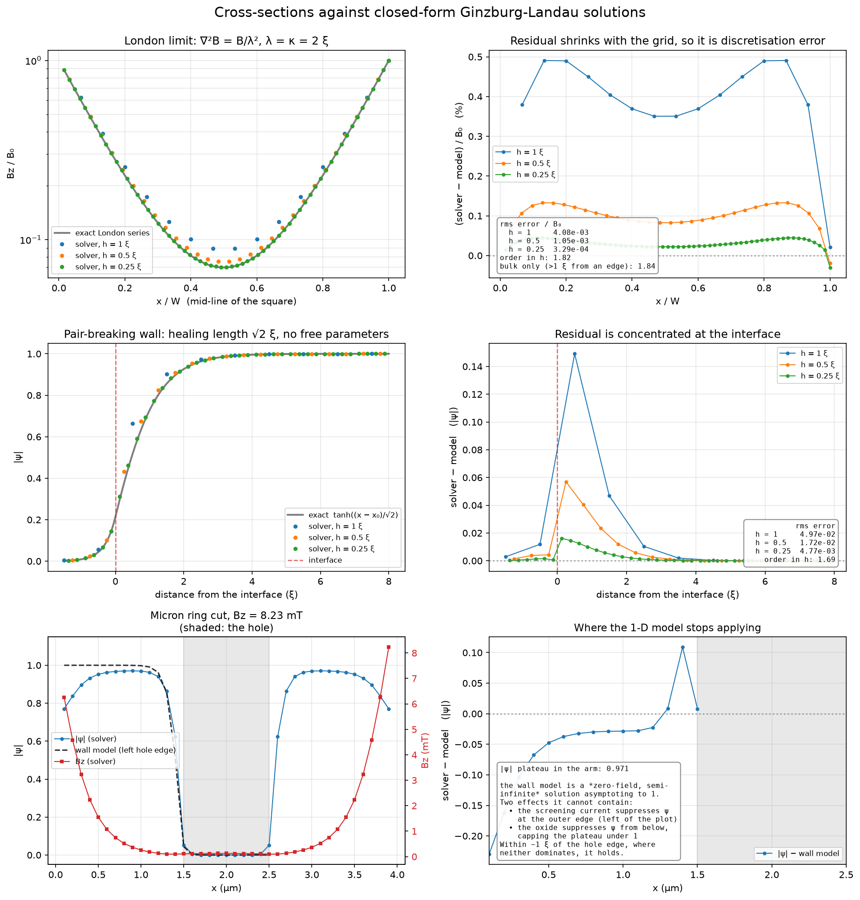](docs/figures/analytic_cross_sections.png)

The bottom row applies the same two models to the micron ring, where neither
holds exactly — and says where each stops applying.

### Meissner screening and vortices

| | |
|:--:|:--:|
| [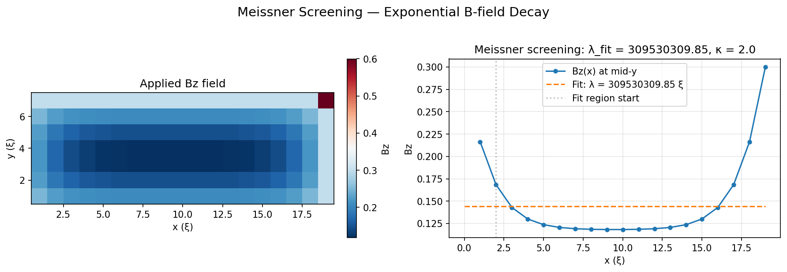](docs/figures/meissner_screening.png) | [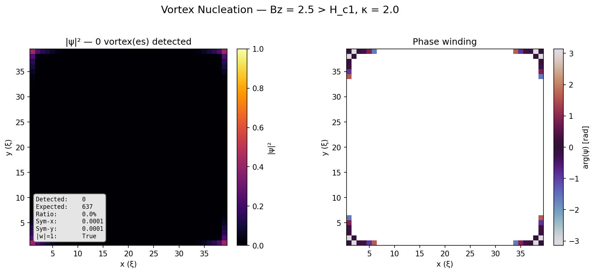](docs/figures/vortex_entry.png) |
| **Meissner screening** — B decays into the bulk with λ = 2.24 ξ against κ = 2.0. | **Vortex lattice** — flux front advancing from the edges at Bz = 0.6, every winding +1. |
| [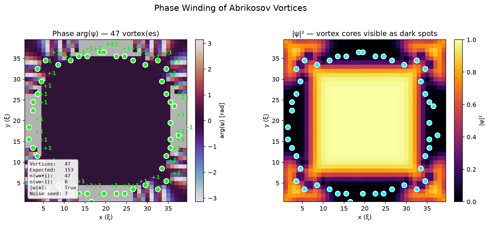](docs/figures/phase_winding.png) | [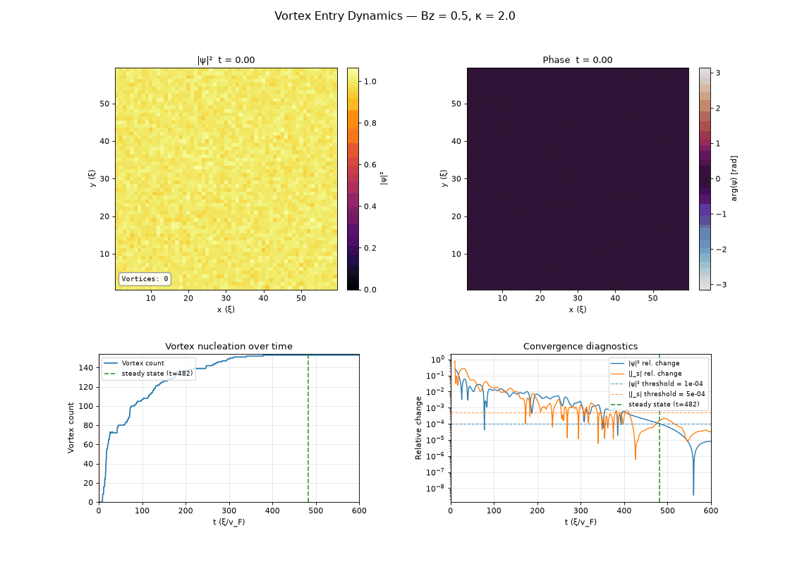](docs/figures/vortex_entry_dynamics.gif) |
| **Phase winding** — ±2π around each core; the vorticity is integral to 1e-16. | **Nucleation dynamics** — vortices enter, interact and settle into a steady population. |

### Holes, currents and numerics

| | |
|:--:|:--:|
| [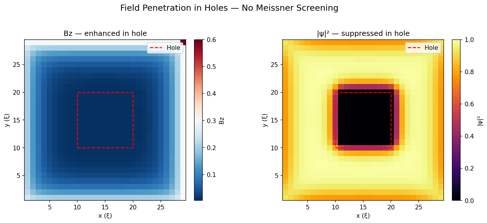](docs/figures/hole_field_penetration.png) | [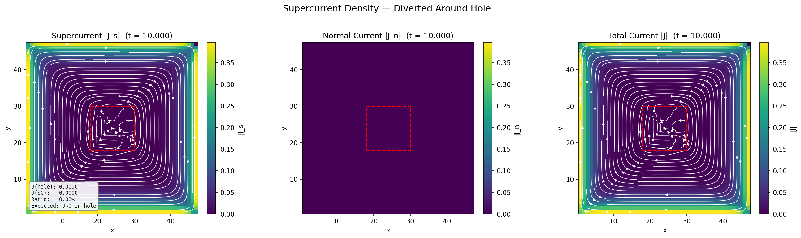](docs/figures/supercurrent_hole.png) |
| **Field in a hole** — the applied field passes through unscreened. | **Screening currents** — J_s circulates around the hole and vanishes inside it. |
| [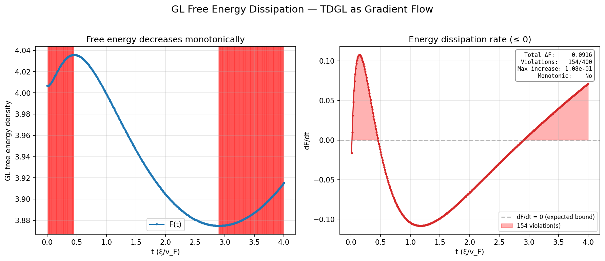](docs/figures/energy_dissipation.png) | [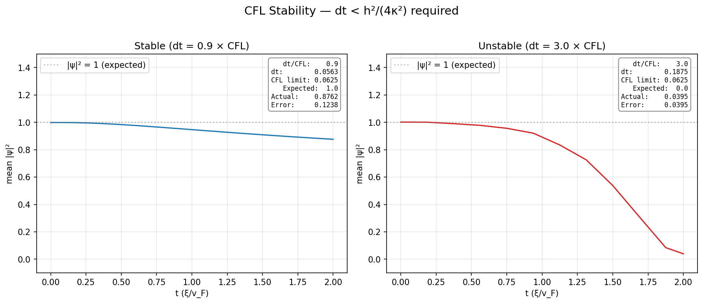](docs/figures/cfl_instability.png) |
| **Free energy** — TDGL is a gradient flow, so F is non-increasing. | **Step-size limit** — stable below the CFL bound, collapse above it. |

## Overview

`tdgl3d` solves the coupled TDGL equations for the superconducting order
parameter ψ and the gauge-invariant vector potential **A** (link variables
φ_x, φ_y, φ_z) in 3D:

```
∂ψ/∂t = (∇ − iA)²ψ + (1 − |ψ|²)ψ

∂A/∂t = κ² ∇×(∇×A) − Im[ψ* (∇ − iA) ψ]
```

The spatial discretisation uses **link variables** (Peierls phases) on a
uniform Cartesian grid, exactly as described in the MATLAB predecessor.

## Performance

The device above is 1.8 M nodes at ξ = 100 nm, and it is the size that decides
whether a study is an afternoon or a month. Measured on 4 cores, per unit of
Ginzburg-Landau time, with forward Euler at 0.9 of the CFL limit:

| ξ(T) | grid | interior nodes | per state vector | s per τ_GL | peak RSS |
|---|---|---|---|---|---|
| 150 nm | 240 × 240 × 9 | 457 k | 29 MB | 5.5 | 0.5 GB |
| 100 nm | 360 × 360 × 15 | 1.80 M | 116 MB | 25.2 | 1.6 GB |
| 70 nm | 514 × 514 × 21 | 5.26 M | 337 MB | 132 | 4.3 GB |
| 50 nm | 720 × 720 × 30 | 15.0 M | 960 MB | 475 | 12.1 GB |

All four were run, not extrapolated. Multiply by the simulated time you need:
the S/I/S ring figure above resolves flux expulsion at `t_stop = 60`, which at
ξ = 100 nm is 25 minutes per field value.

**Use forward Euler.** `solve()` defaults to the implicit trapezoidal
integrator, which on a grid this size costs roughly 8× more per unit simulated
time. Its Newton-GCR inner solve is unpreconditioned, so the Krylov iteration
count grows about as fast as the step size it buys and the larger step never
pays for itself — swept over `dt` from 0.02 to 0.8, its cost bottoms out at
2.8× Euler's. Every figure in `docs/figures/` uses Euler. A diagonal (Jacobi)
preconditioner does not fix this and was measured not to: see
[`docs/notes/PHYSICS_CONVENTIONS.md`](docs/notes/PHYSICS_CONVENTIONS.md).

Three knobs matter at scale:

| Knob | What it does |
|---|---|
| `TDGL3D_NUM_THREADS` | Pool size for the right-hand side. It is memory-bandwidth-bound, which is the case more cores help: 3.1× on four. |
| `solve(..., stream_path=...)` | Writes frames to HDF5 as they are produced, so memory holds one frame however long the run is. A frame is 960 MB at 15 M nodes, so sixty of them would otherwise be 58 GB. The file is a complete artifact `Solution.load` reads. |
| `solve(..., precision="single")` | complex64 state — halves both the memory a mesh needs and the bandwidth the evaluation is limited by (25.9 → 17.5 s per τ_GL at 1.8 M nodes). Divergence from a double run saturates near 1e-6 relative rather than accumulating, because TDGL is a gradient flow toward a stable attractor; confirm published numbers at double precision. |

## Theoretical Background

### The TDGL Model

The time-dependent Ginzburg-Landau equations describe the relaxation dynamics of a superconductor toward its equilibrium state. They capture the interplay between the superconducting order parameter **ψ** (representing Cooper pair density and phase) and the electromagnetic vector potential **A** (representing the magnetic field).

#### Order Parameter Equation

```
∂ψ/∂t = (∇ − iA)² ψ + (1 − |ψ|²) ψ
```

- **Left side**: Rate of change of the order parameter
- **First term** `(∇ − iA)² ψ`: Gauge-covariant Laplacian representing kinetic energy and screening currents. The `−iA` coupling ensures gauge invariance and encodes the Meissner effect.
- **Second term** `(1 − |ψ|²) ψ`: Nonlinear "potential" term that drives |ψ| → 1 in superconducting regions (equilibrium condensate density) and |ψ| → 0 in normal regions.

#### Gauge Field Equation

```
∂A/∂t = κ² ∇×(∇×A) − Im[ψ* (∇ − iA) ψ]
```

- **Left side**: Rate of change of the vector potential (related to electric field via Faraday's law)
- **First term** `κ² ∇×(∇×A)`: Magnetic diffusion with diffusion constant κ² (proportional to normal conductivity). For Type-II superconductors, κ > 1/√2.
- **Second term** `−Im[ψ* (∇ − iA) ψ]`: Supercurrent density **J_s**. This is the dissipationless current carried by Cooper pairs, which screens applied magnetic fields.

**Physical interpretation**: The gauge field evolves to balance magnetic diffusion against supercurrent screening. In equilibrium (∂A/∂t = 0), the supercurrent exactly cancels the curl of the vector potential, resulting in zero total current.

### Key Physical Phenomena

#### Meissner Effect

In bulk superconductors with |ψ| ≈ 1, supercurrents spontaneously arrange to expel applied magnetic fields:

```
J_s = −∇×B  ⟹  B → 0  in bulk SC
```

The screening occurs over the **penetration depth** λ ∝ κ. In our dimensionless units (length in units of coherence length ξ), λ/ξ = κ.

#### Vortex Formation (Type-II)

When the applied field exceeds the lower critical field **H_c1**, magnetic flux penetrates the superconductor in quantized vortices. Each vortex:

- Carries exactly one flux quantum Φ₀ = h/2e
- Has a normal core where |ψ| → 0 with radius ~ ξ (coherence length)
- Generates circulating supercurrents in an annulus of radius ~ λ (penetration depth)
- Exhibits phase winding: arg(ψ) increases by 2π around the vortex core

For Type-II superconductors (κ > 1/√2), vortices repel and form a triangular Abrikosov lattice at high fields.

#### Supercurrent Density

The supercurrent is computed from the gauge-covariant gradient:

```
J_s = Im[ψ* (∇ − iA) ψ]
```

In discrete form (link variables):
```
J_s,x[m] = Im[ ψ*[m] · exp(−iφ_x[m]) · ψ[m+1] ] / hx
```

where `φ_x[m]` is the Peierls phase (line integral of **A**) on the link from node `m` to `m+1`. This formulation guarantees gauge invariance and current conservation on the discrete lattice.

#### Insulator Regions & Holes

Non-superconducting regions (insulators, holes) are modeled by:

1. **Suppressing ψ**: Adding a relaxation term `−ψ/τ_relax` (τ = 0.1) drives ψ → 0
2. **Leaving the Maxwell term alone**: the `κ²∇×∇×A` coefficient is the field energy `B²/2μ₀`, which belongs to the field rather than to the material, so it keeps the reference `params.kappa` in an insulator, in a hole and in vacuum.  A decldeclared `kappa` of 0 would zero that term, which would degenerate the φ-equation and freeze **A** — so the layer would neither screen nor transmit.

This allows **magnetic flux penetration** into holes without screening:
```
In holes:  |ψ| ≈ 0  ⟹  J_s ≈ 0  ⟹  B ≈ B_applied
```

Holes act as "windows" through which the applied field can pass unimpeded, creating strong field gradients at the hole/superconductor interface and persistent screening currents circulating around the hole perimeter.

### Dimensionless Units

All quantities are dimensionless, scaled to characteristic superconductor scales:

| Quantity | Physical | Dimensionless | Typical |
|----------|----------|---------------|---------|
| Length | x̃ | x = x̃/ξ | ξ ~ 10–100 nm |
| Time | t̃ | t = t̃/(ξ²/D) | D ~ diffusivity |
| Field | B̃ | B = B̃/B_c2 | B_c2 ~ upper critical field |
| Order param | ψ̃ | ψ = ψ̃/ψ₀ | ψ₀ ~ equilibrium value |

In these units:
- **κ** is the Ginzburg-Landau parameter (ratio of penetration depth to coherence length)
- Grid spacing **h** is in units of ξ (typically h ~ 0.5–1 ξ for numerical accuracy)
- Applied field **B** is in units of B_c2 (typically B ~ 0.1–1 for vortex studies)

### Numerical Discretization

#### Link Variables (Peierls Phases)

Instead of storing **A** directly, we use **link variables** φ defined on edges:

```
φ_x[m] = ∫_{m}^{m+1} A_x dx  ≈  A_x[m] · hx
```

This ensures:
- **Gauge invariance**: Physical observables (|ψ|, B, J) are independent of gauge choice
- **Flux conservation**: ∮ φ · dl = ∫∫ B · dS (discrete Stokes' theorem)
- **Stability**: No spurious modes or checkerboard instabilities

The curl and divergence operators are implemented as sparse CSR matrices acting on the compact interior-node representation.

#### Boundary Conditions

**Zero-current BCs** (natural for isolated films):
```
n̂ · J_s = 0  on boundary
```

Implemented by setting normal link variables to zero and using ghost-node reflections for tangential components.

**Applied magnetic field**: Encoded via Peierls phases on boundary links:
```
φ_boundary = ± B_applied · (hx·hy)  (sign depends on face orientation)
```

This writes the external field into the link variables, allowing it to diffuse into the interior and interact with supercurrents.

### Verification

The physics is pinned down by five suites in `packages/tdgl3d/tests/`, organised
by principle rather than by feature:

| Suite | Verifies |
|-------|----------|
| `test_verification_gauge.py` | local U(1) covariance of the RHS; gauge invariance of \|ψ\|, B, J_s, F and the vortex count |
| `test_verification_conservation.py` | ∇·B = 0 and ∇·(∇×∇×A) = 0 to round-off; free energy as a Lyapunov functional; ∇·J_s = 0 in steady state |
| `test_verification_symmetry.py` | applied flux on the boundary plaquettes; B → −B; C4 and mirror symmetry; index ordering on non-cubic grids |
| `test_verification_analytic.py` | λ = κ; lowest Landau level E₀ = B (so H_c2 = 1); second order in h, first order in dt |
| `test_verification_vortex.py` | exact fluxoid quantisation; winding sign follows the field sign; lattice Stokes |
| `test_verification_vacuum.py` | the applied field is exact in vacuum; a κ contrast in a currentless region changes nothing; a lateral margin unpins the film edge; flux crowds beside it; the far field converges with padding |

Three numbers anchor the normalisation: **Φ₀ = 2π**, **λ = κ** (in ξ), and
**H_c2 = 1**. An applied field above 1 leaves a normal metal, not a vortex
lattice. The sign and index conventions the solver depends on — and which test
fails when each is broken — are recorded in
[`docs/notes/PHYSICS_CONVENTIONS.md`](docs/notes/PHYSICS_CONVENTIONS.md).

```bash
cd packages/tdgl3d
python3 -m pytest tests/test_verification_*.py tests/test_physics_validation.py -q
cd ../.. && python3 docs/generate_test_report.py --input packages/tdgl3d/logs
```

The report lists every check with its measured value, the value physics
requires, and the tolerance allowed.

### Further Reading

- **Original theory**: Ginzburg & Landau, *Zh. Eksp. Teor. Fiz.* **20**, 1064 (1950)
- **TDGL formulation**: Gorkov & Eliashberg, *Sov. Phys. JETP* **27**, 328 (1968)  
- **Link-variable discretization**: Machida & Koyama, *Phys. Rev. Lett.* **90**, 077003 (2003)
- **Implementation reference**: See `docs/6336__Final_Report_Type_II_Superconductor_Vortices.pdf` for detailed derivation and validation

## Features

| Feature | Description |
|---------|-------------|
| **3D structured grid** | Uniform Cartesian mesh with configurable Nx×Ny×Nz |
| **S/I/S trilayer** | Multi-material support via per-node κ and superconductor mask |
| **Boundary conditions** | Zero-current BCs; applied B-field via link-variable BCs |
| **Applied field ramp** | Linear ramp from 0 to full magnitude over a configurable fraction, or an arbitrary `field_func(t, t_stop)` schedule |
| **Time integrators** | Forward Euler (explicit) and Trapezoidal (implicit, Newton-GCR) |
| **Matrix-free Newton-GCR** | Jacobian-free Newton-Krylov solver for the implicit step, with a truncated Krylov basis |
| **Threaded right-hand side** | Interior split across a thread pool sized by `TDGL3D_NUM_THREADS`; the evaluation is bandwidth-bound, so cores help |
| **Single precision** | `precision="single"` runs the state in complex64 — half the memory, half the bandwidth |
| **Streamed history** | `stream_path=` writes frames to HDF5 as produced, so a long run at a fine mesh is not limited by RAM |
| **Sparse operators** | Discrete Laplacian and forcing operators available as `scipy.sparse` matrices; the solver applies them matrix-free |
| **Post-processing** | B-field evaluation, order-parameter magnitude, vorticity |
| **Visualization** | 2D slice plots, 3D isometric scatter plots, animated GIFs |
| **HDF5 I/O** | Save/load solutions via h5py |
| **Validation suite** | 337 tests carrying 294 recorded physics checks — gauge invariance, exact discrete identities, symmetry, closed-form limits, fluxoid quantisation, trilayer, interfaces and vacuum |

## Installation

```bash
cd tdgl3d
pip install -e ".[dev]"
pytest          # 337 tests
```

**Requirements:** Python ≥ 3.10, numpy ≥ 1.24, scipy ≥ 1.10, matplotlib ≥ 3.7,
h5py ≥ 3.8, tqdm ≥ 4.65.  Dev extras add pytest, pytest-cov, ruff.

## Quick start

### Single-layer thin film

```python
import tdgl3d

params = tdgl3d.SimulationParameters(
    Nx=20, Ny=20, Nz=4,
    hx=1.0, hy=1.0, hz=1.0,
    kappa=5.0,
)
field = tdgl3d.AppliedField(Bz=1.0, ramp=True, ramp_fraction=0.3)
device = tdgl3d.Device(params, applied_field=field)

solution = tdgl3d.solve(device, t_stop=10.0, dt=0.05, method="trapezoidal")

solution.plot_order_parameter(slice_z=2)
```

### S/I/S trilayer

```python
import tdgl3d

trilayer = tdgl3d.Trilayer(
    bottom=tdgl3d.Layer(thickness_z=3, kappa=2.0),
    # κ is is recorded but carries no physics in a non-superconducting
    # layer: the Maxwell term takes the vacuum coefficient everywhere.
    insulator=tdgl3d.Layer(thickness_z=1, kappa=0.0, is_superconductor=False),
    top=tdgl3d.Layer(thickness_z=3, kappa=2.0),
)
params = tdgl3d.SimulationParameters(Nx=20, Ny=20, kappa=2.0)
field = tdgl3d.AppliedField(Bz=0.5, ramp=True)
device = tdgl3d.Device(params, applied_field=field, trilayer=trilayer)

x0 = device.initial_state()          # ψ=0 in insulator, |ψ|=1 in SC
solution = tdgl3d.solve(device, t_stop=5.0, dt=0.02, method="euler", x0=x0)
```

## Public API

| Symbol | Module | Description |
|--------|--------|-------------|
| `SimulationParameters` | `core.parameters` | Grid size (Nx, Ny, Nz), spacing (hx, hy, hz), κ, periodic BCs |
| `Device` | `core.device` | Bundles params + field + optional trilayer; builds indices & material map |
| `StateVector` | `core.state` | Wraps flat `[ψ, φ_x, φ_y, φ_z]` vector with named views (`.psi`, `.phi_x`, …) |
| `AppliedField` | `physics.applied_field` | Constant or ramped `(Bx, By, Bz)`; optional `field_func(t, t_stop)` callable |
| `Layer` | `core.material` | Single material layer: `thickness_z`, `kappa`, `is_superconductor` |
| `Trilayer` | `core.material` | S/I/S stack of three `Layer`s; computes `Nz`, `z_ranges()` |
| `MaterialMap` | `core.material` | Per-node arrays: `kappa`, `sc_mask`, `interior_sc_mask` |
| `Solution` | `core.solution` | Stores `times` + `states` matrix; methods for B-field, order param extraction |
| `solve()` | `solvers.runner` | Main entry — runs Forward Euler or Trapezoidal integration |

## Architecture & data flow

```
User script
  │
  ▼
Device(params, applied_field, trilayer?)
  │  ├─ constructs GridIndices   (mesh/indices.py)
  │  └─ constructs MaterialMap   (core/material.py)  ← only if trilayer
  │
  ▼
solve(device, ...)                       (solvers/runner.py)
  │  ├─ builds eval_u(t, X) closure      (physics/applied_field.py)
  │  ├─ extracts device.material (or None)
  │  └─ calls forward_euler() or trapezoidal()
  │                                       (solvers/integrators.py)
  ▼
Time-step loop
  │  eval_f(X, params, idx, u, material)  (physics/rhs.py)
  │    ├─ expand interior → full grid
  │    ├─ apply boundary conditions (link-variable BCs from applied B)
  │    ├─ construct LPSI_{x,y,z} · X_full           (operators/sparse_operators.py)
  │    ├─ construct FPSI(X_full, material)           nonlinear + insulator relaxation
  │    ├─ construct LPHI_{x,y,z}(material) · X_full  per-node κ in curl-curl
  │    ├─ construct FPHI_{x,y,z}(X_full, material)  supercurrent + per-node κ
  │    └─ strip to interior rows → dX/dt
  │
  │  (Trapezoidal only)
  │  newton_gcr_trap(f_closure, ...)      (solvers/newton.py)
  │    └─ tgcr_matrix_free_trap(...)      (solvers/tgcr.py)
  │
  ▼
Solution(times, states, params, idx)     (core/solution.py)
  ├─ .order_parameter(step)  → 3D |ψ|²
  ├─ .bfield(step)           → (Bx, By, Bz)
  ├─ .plot_order_parameter() / .plot_bfield()
  └─ save_solution() / load_solution()   (io/hdf5.py)
```

### Key design decisions

- **State vector layout:** `[ψ, φ_x, φ_y, φ_z]` each of length `n_interior`.
  For 2D (`Nz=1`) the `φ_z` block is omitted.
- **Interior / full-grid duality:** PDE is evaluated on the full
  `(Nx+1)×(Ny+1)×(Nz+1)` grid (operators are full-grid sparse matrices).
  Only interior rows are extracted for the time derivative.
  `idx.interior_to_full` maps interior numbering → full linear index.
- **Link-variable BCs:** `_apply_boundary_conditions()` in `rhs.py` writes
  the applied-field Peierls phases onto boundary link variables before
  each operator evaluation.
- **Material threading:** `MaterialMap` flows from `Device` → `solve()` →
  `integrators` → `eval_f()` → individual operators.  When `material is None`
  all operators fall back to the uniform `params.kappa`.
- **Insulator suppression:** In `construct_FPSI`, insulator nodes get an
  extra `−ψ/τ_relax` (τ_relax = 0.1) driving ψ → 0 without hard discontinuity.
- **Maxwell coefficient is the vacuum's:** the κ² multiplying `∇×(∇×A)`
  is the field energy `B²/2μ₀`, not a material property, so it
  is uniform — the superconductor's `params.kappa` everywhere,
  insulators and vacuum included.  A per per-layoverride
  (`Layer.magnetic_kappa`) exists for models that want a varying
  coefficient; where it is used the coefficient is evaluated on
  plaquettes, which keeps the curl-curl operator self-adjoint.
- **Applied field needs free boundaries:** the field is written onto
  the ghost links closing the boundary plaquettes, and a periodic axis
  has none, so an applied field on a grid with any periodic axis is
  refused rather than silently returning the wrong field.
- **CFL condition (Forward Euler):** dt < h² / (4κ²(d−1)), set by the stiff
  κ²∇×∇× term.  In 2D (d=2) this is the familiar h²/(4κ²) — with h=1, κ=2,
  dt < 0.0625.  In 3D each link variable gains a second transverse Laplacian
  direction, the curl-curl block's spectral radius doubles and the limit halves:
  dt < 0.03125 for the same h and κ.  A 3D run at "0.9 CFL" computed from the 2D
  formula diverges.

## Project layout

```
tdgl3d/
├── src/tdgl3d/
│   ├── __init__.py          # Public exports
│   ├── core/
│   │   ├── parameters.py    # SimulationParameters dataclass
│   │   ├── device.py        # Device: params + field + trilayer → indices + material
│   │   ├── state.py         # StateVector: named views into [ψ, φ_x, φ_y, φ_z]
│   │   ├── solution.py      # Solution: times + states + post-processing
│   │   └── material.py      # Layer, Trilayer, MaterialMap, build_material_map()
│   ├── mesh/
│   │   └── indices.py       # GridIndices: 26 face/mask arrays, interior_to_full
│   ├── operators/
│   │   └── sparse_operators.py  # LPSI, LPHI, FPSI, FPHI — scipy.sparse CSR
│   ├── physics/
│   │   ├── rhs.py           # eval_f(): full RHS evaluation dX/dt
│   │   ├── applied_field.py # AppliedField + build_boundary_field_vectors()
│   │   └── bfield.py        # eval_bfield(): B = curl(A) at interior nodes
│   ├── solvers/
│   │   ├── runner.py        # solve(): high-level entry point
│   │   ├── integrators.py   # forward_euler(), trapezoidal()
│   │   ├── newton.py        # newton_gcr(), newton_gcr_trap()
│   │   └── tgcr.py          # tgcr_matrix_free(), tgcr_matrix_free_trap()
│   ├── visualization/
│   │   └── plotting.py      # plot_order_parameter, plot_bfield, animate
│   └── io/
│       └── hdf5.py          # save_solution(), load_solution()
├── tests/
│   ├── test_parameters.py   # 11 tests — SimulationParameters validation
│   ├── test_indices.py      # 11 tests — GridIndices construction, symmetry
│   ├── test_operators.py    # 12 tests — operator shapes, symmetry, sparsity
│   ├── test_state.py        #  7 tests — StateVector views, factory methods
│   ├── test_physics.py      # 11 tests — eval_f, BCs, applied field
│   ├── test_solvers.py      #  7 tests — Euler/Trap convergence, Newton
│   ├── test_integration.py  #  7 tests — end-to-end solve() smoke tests
│   ├── test_visualization.py# 17 tests — plotting functions
│   ├── test_trilayer.py     # 18 tests — Layer/Trilayer/MaterialMap/Device/sim
│   └── validate_analytical.py  # Analytical Jacobian comparison
├── examples/
│   ├── isometric_film_3d.py    # Dual-panel |ψ|² + phase isometric scatter
│   ├── vortex_3d.py            # 3D vortex nucleation
│   ├── vortex_entry_2d.py      # 2D thin-film vortex entry
│   ├── check_symmetry.py       # C4 symmetry verification
│   ├── verify_indices_bc.py    # Index & BC validation against MATLAB
│   └── generate_default_plot.py
└── pyproject.toml
```

## Test suite

```bash
pytest                  # all 337 tests
pytest -k trilayer      # just trilayer tests
pytest -k verification  # the physics verification suites only
pytest --cov=tdgl3d     # with coverage
```

The `test_verification_*.py` suites record every physics check they make — the
measured value, the value physics requires, and the tolerance allowed — so each
one is falsifiable rather than a bare assertion. Regenerate the tabulated
results with:

```bash
cd packages/tdgl3d && python3 -m pytest tests/test_verification_*.py -q
cd ../.. && python3 docs/generate_test_report.py --input packages/tdgl3d/logs
```

The current run is in [`docs/physics_test_report.md`](docs/physics_test_report.md)
(294/294 checks passing); the conventions the checks depend on — gauge, index
ordering, node-versus-plaquette centring, the CFL limit's dimension dependence —
are written down in
[`docs/notes/PHYSICS_CONVENTIONS.md`](docs/notes/PHYSICS_CONVENTIONS.md).

## Versioning and changelog

Versions follow [Semantic Versioning](https://semver.org/spec/v2.0.0.html) and
changelogs follow [Keep a Changelog](https://keepachangelog.com/en/1.1.0/). Each
package is versioned independently; [`CHANGELOG.md`](CHANGELOG.md) indexes them.

Both are generated from Conventional Commit messages by release-please, so the
commit subject is the changelog entry and nothing is written by hand. The policy
— including what counts as a breaking change when a package's output is numbers,
where "more accurate" and "was wrong" land on opposite sides of the major/patch
line — is in [`docs/notes/VERSIONING.md`](docs/notes/VERSIONING.md).

## MATLAB provenance

This package is a Python rewrite of the 3D TDGL MATLAB code developed for MIT
6.336 (Spring 2021).  The original `.m` files live in the parent directory.
Index-for-index verification against the MATLAB code is documented in
`examples/verify_indices_bc.py`.
"""
