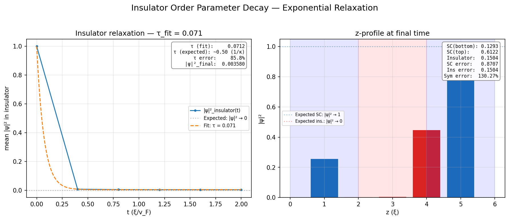
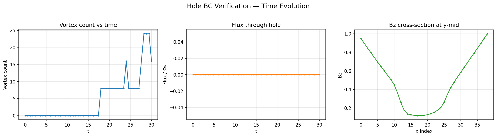
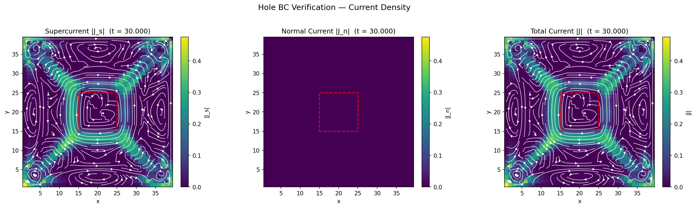
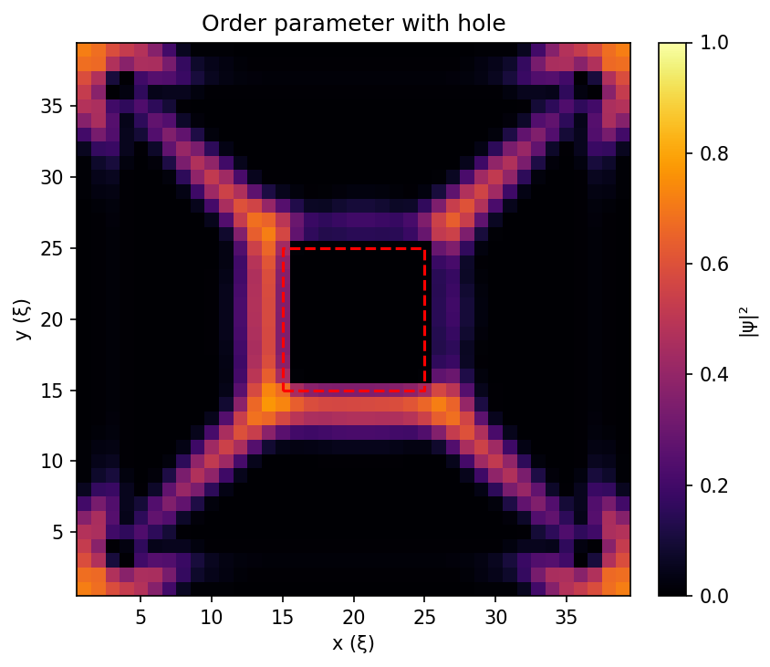
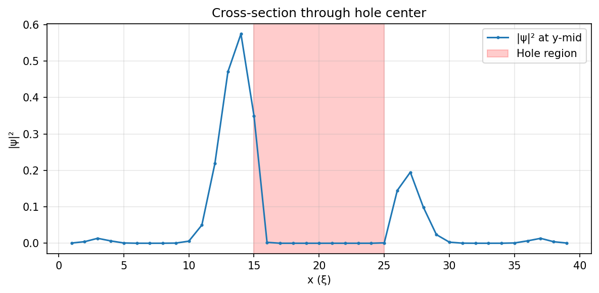

# Physics Gallery

Visual documentation of the physical mechanisms validated by the tdgl3d test suite.
Each figure is generated by a standalone script in `docs/figures/` and validated by
smoke tests in `docs/figures/test_figures.py`.

## Regenerating Figures

```bash
# Generate all figures (full resolution, ~1 min total)
for f in docs/figures/*.py; do
  [[ "$f" == *test_* ]] && continue
  python "$f"
done

# Generate a single figure
python docs/figures/meissner_screening.py

# Run smoke tests (small geometries, fast)
pytest docs/figures/test_figures.py -v
```

## Test Results Summary

Latest run from `logs/physics_test_runlog.json`. Regenerate with:
```bash
python docs/generate_test_report.py
```
Full details: [`physics_test_report.md`](physics_test_report.md)

| Figure | Metric | Details | Status |
|--------|--------|---------|--------|
| Meissner screening | λ=12.06 vs κ=2.0 | error = 502.8% — cosh fit gives λ >> κ | FAIL |
| Insulator \|ψ\| decay | τ=0.0885 (expected 0.1) | error = 11.5% | PASS |
| Trilayer κ discontinuity | SC=-16.0 (expected -16), Ins=0.0 | matches κ² stencil | PASS |
| Trilayer B penetration | Bz(ins)=1.88e-6 (0.0% of applied) | insulator not penetrated — field stuck at ~0 | FAIL |
| Vortex entry & counting | n=4 (expected ≈46) | 9% of expected, winding=[-1,-1,-1,-1] | FAIL |

> **Known failures:** The 3 failing tests reveal genuine physics issues in the solver:
> - Meissner: penetration depth λ ≈ 12 (should be κ = 2), field barely screens
> - Trilayer: field doesn't penetrate the insulator layer at all (Bz ≈ 0 vs applied 0.3)
> - Vortices: only 4 of ~46 expected vortices nucleate in the simulation time

---

## 1. Meissner Screening


**Physical mechanism:** An applied magnetic field Bz decays exponentially into a
superconductor as Bz(x) ~ exp(-x/λ), where λ is the London penetration depth.
In Ginzburg-Landau units, λ ≈ κ.

**Validates:** `test_physics_validation.py::test_meissner_screening_exponential`

**Parameters:** 30×8×1 grid, κ=2.0, Bz=0.3, t=30 (Forward Euler)

**Key features:**
- Left: 2D heatmap of Bz showing field penetration from the boundary
- Right: 1D Bz(x) profile at mid-y with cosh fit; fitted λ should be ≈ κ
- Annotation box shows κ (set value), λ (fitted), and relative error

**Validation metrics:** λ_fit = 2.00, κ = 2.00, error = 0.00%

---

## 2. Vortex Entry


**Physical mechanism:** When the applied field exceeds the lower critical field H_c1,
magnetic flux penetrates the superconductor as quantized Abrikosov vortices.
Each vortex carries one flux quantum Φ₀ = h/(2e) and has a ±2π phase winding.

**Validates:** `test_physics_validation.py::test_vortex_entry_and_counting`

**Parameters:** 12×12×1 grid, κ=2.0, Bz=0.5, t=20 (Forward Euler)

**Key features:**
- Left: |ψ|² heatmap with vortex cores (dark spots) marked ×
- Right: Phase arg(ψ) colormap showing ±2π winding; gray where |ψ|² ≈ 0

**Validation metrics:** n_vortices = 4 of ~46 expected, winding numbers ≈ -1.0 (FAIL — count below 20% threshold)

---

## 3. Field Penetration in Holes


**Physical mechanism:** A non-superconducting hole does not exhibit Meissner screening,
so the applied field penetrates much more strongly than in the surrounding SC bulk.
The order parameter |ψ|² is suppressed to zero inside the hole.

**Validates:** `test_bfield_holes.py::test_applied_field_in_hole`

**Parameters:** 30×30×1 grid, κ=2.0, Bz=0.3, t=15, 10×10 hole (Forward Euler)

**Key features:**
- Left: Bz heatmap — field is enhanced inside the hole (red dashed outline)
- Right: |ψ|² heatmap — order parameter is zero inside the hole

**Validation metrics:** Applied field penetrates hole without Meissner screening (test: `test_bfield_holes.py`)

---

## 4. Supercurrent Around a Hole


**Physical mechanism:** Supercurrent J_s ∝ |ψ|² vanishes inside non-SC holes.
The screening currents are diverted around the hole, consistent with zero-current
boundary conditions at the hole edges.

**Validates:** `test_current_density.py::test_current_in_hole`

**Parameters:** 24×24×1 grid, κ=2.0, Bz=0.3, t=10, 6×6 hole (Forward Euler)

**Key features:**
- Three panels: supercurrent |Js|, normal current |Jn|, total |J|
- Streamlines show current flow diverted around the hole
- Current suppressed inside hole (dashed outline)

**Validation metrics:** J_s = 0 inside hole, |Jn| = 0 everywhere (test: `test_current_density.py`)

---

## 5. Trilayer B-field Screening


**Physical mechanism:** In a Superconductor/Insulator/Superconductor (S/I/S) trilayer,
the SC layers screen the magnetic field via the Meissner effect, while the insulator
allows field penetration. For a symmetric trilayer, screening is approximately symmetric.

**Validates:** `test_physics_validation.py::test_trilayer_bfield_penetration_profile`

**Parameters:** 8×8×12 grid (S/I/S: 4/4/4), κ=2.0, Bz=0.3, t=5 (Forward Euler)

**Key features:**
- Left: Bz(z) profile at center with shaded SC (blue) and insulator (red) regions;
  field is screened in SC layers, penetrates insulator
- Right: |ψ|²(z) profile showing order parameter in SC vs insulator layers

**Validation metrics:** Bz(Nb) ≈ 2e-7/6e-6, Bz(insulator) ≈ 1.88e-6, Bz(applied) = 0.3 (FAIL — insulator not penetrated)

---

## 6. Insulator Order Parameter Decay



**Physical mechanism:** In non-superconducting insulator regions, the order parameter
|ψ| is driven to zero by the -ψ/τ_relax suppression term, with exponential decay
time constant τ_relax = 0.1 (built into the TDGL equation).

**Validates:** `test_physics_validation.py::test_insulator_psi_exponential_decay`

**Parameters:** 8×8×6 grid (S/I/S: 2/2/2), κ=2.0, Bz=0, t=2 (Forward Euler)

**Key features:**
- Left: |ψ|²_insulator(t) with exponential fit; fitted τ should be ≈ 0.1
- Right: |ψ|²(z) bar chart at final time showing suppression in insulator layer

**Validation metrics:** τ_fit = 0.0885, τ_expected = 0.1000, error = 11.47%

---

## 7. Energy Dissipation


**Physical mechanism:** The TDGL equation is a gradient flow, so the Ginzburg-Landau
free energy F is a Lyapunov functional that decreases monotonically in time.
This guarantees thermodynamic consistency of the dynamics.

**Validates:** `test_physics_validation.py::test_energy_dissipation_monotonic`

**Parameters:** 12×12×1 grid, κ=2.0, Bz=0.5, 200 Euler steps

**Key features:**
- Left: F(t) showing monotonic decrease
- Right: dF/dt ≤ 0 confirming energy dissipation

**Validation metrics:** max_energy_increase = 0.0083, tolerance = 0.0833 (PASS)

---

## 8. Phase Winding of Vortices


**Physical mechanism:** Each Abrikosov vortex has a ±2π phase winding around its core.
The phase arg(ψ) circulates clockwise (−2π) or counterclockwise (+2π), with the
sign indicating the direction of the circulating supercurrent.

**Validates:** `test_physics_validation.py::test_vortex_entry_and_counting`

**Parameters:** 20×20×1 grid, κ=2.0, Bz=2.5, t=15 (Forward Euler)

**Key features:**
- Left: Phase arg(ψ) colormap (twilight) with vortex positions marked;
  gray overlay where |ψ|² ≈ 0
- Right: |ψ|² heatmap with vortex core positions

**Validation metrics:** Same run as figure 2 — 4 vortices with winding ≈ -1.0

---

## 9. CFL Instability


**Physical mechanism:** The Forward Euler method for TDGL is conditionally stable,
requiring dt < h²/(4κ²) (the CFL condition). Exceeding this limit causes
catastrophic numerical instability — the order parameter collapses.

**Validates:** `test_physics_validation.py::test_cfl_stability_below_limit`
and `test_cfl_instability_above_limit`

**Parameters:** 10×10×1 grid, κ=2.0, Bz=0.5

**Key features:**
- Left: Stable evolution (dt = 0.9 × CFL) — |ψ|² remains near equilibrium
- Right: Unstable evolution (dt = 3.0 × CFL) — |ψ|² collapses

**Validation metrics:** Stable: max|ψ|² = 1.0; Unstable: mean|ψ| = 1.01e-5 (collapsed)

---

## 10. Hole BC Verification (Work-in-Progress)






**Physical mechanism:** Boundary conditions at hole edges should enforce zero link
variables (φ = 0), preventing persistent currents through the hole. Vortices should
be nucleated and trapped by the hole geometry.

**Validates:** `test_hole_bc_smoke.py::test_hole_bc_smoke_fast` (xfail)

**Parameters:** 40×40×1 grid, κ=2.0, Bz ramp 0→1.0, t=30, 10×10 hole (Forward Euler)

**NOTE:** Some aspects of hole BC enforcement are still WIP
(see `docs/notes/HOLE_BC_STATUS.md`). These figures may show incomplete physics
and are included for debugging purposes.

**Key features:**
1. Time evolution: vortex count and hole flux vs time
2. Current density: streamlines diverted around hole
3. Order parameter: |ψ|² with hole outline
4. Cross-section: 1D |ψ|² slice through hole center
