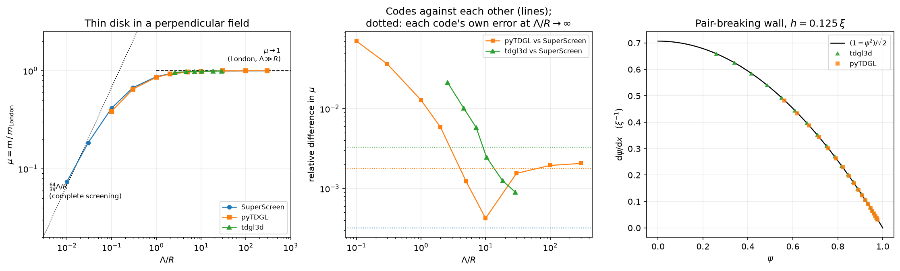

# tdgl3d against pyTDGL and SuperScreen

Two questions, and they are not the same question:

1. **How far is each code from an exact answer?** Only askable where a
   closed form exists, which is at the ends of the parameter range and
   not in the middle.
2. **How far is each code from the others?** Askable everywhere,
   including the crossover between limits — which is where the physics
   people actually simulate lives, and where nothing can be checked
   analytically.

A code can pass the first and fail the second. Both are measured here,
by `packages/tdgl3d/benchmarks/`; the numbers below come from
`benchmarks/results.json` and are regenerated by
`python3 -m benchmarks.run all`.

## The three codes do not solve the same equations

| | `tdgl3d` | [pyTDGL](https://py-tdgl.readthedocs.io) | [SuperScreen](https://superscreen.readthedocs.io) |
|---|---|---|---|
| Equations | 3-D TDGL, ψ and **A** | 2-D TDGL, ψ and a sheet **A** | thin-film London only |
| Order parameter | yes | yes | **no** |
| Geometry | Cartesian grid, real thickness | triangular mesh, zero thickness | triangular mesh, zero thickness |
| Screening | 3-D Maxwell in a box of vacuum | Biot-Savart from the sheet current | Biot-Savart from the sheet current |
| Pearl length Λ | an outcome of κ, thickness and ψ | an input, λ²/d | an input |
| Surface against vacuum | pair-breaking | free (∇ψ·n̂ = 0) | n/a |

Those rows decide what can be compared with what. SuperScreen has no
condensate, so it cannot be asked anything about ψ. `tdgl3d` is not a
thin-film code, so putting it on the thin-film axis at all takes work,
and there is a range of that axis it cannot reach at any affordable
cost. Both facts are measured below rather than asserted.

## Benchmark 1 — a thin disk in a perpendicular field

[](../figures/cross_tool_benchmark.png)

Magnetostatics, which all three codes do, on the one geometry whose
weak-screening solution is exact rather than approximate. In the London
limit the thin-film equation is

    K = -A / (μ₀Λ),   Λ = λ²/d,

and on a **disk** the symmetric-gauge applied potential
`A = ½ B r φ̂` already satisfies both `∇·A = 0` and `A·n̂ = 0` on the
edge, so no gauge correction is needed to keep the current inside the
film and `K = -B r / (2μ₀Λ)` is exact as `Λ/R → ∞`. On a square it is
not, which is why the benchmark is a disk.

The reported quantity is dimensionless:

    μ = m / m_London,    m_London = -π H_a R⁴ / (8Λ),

each code's magnetic moment over its own weak-screening closed form,
computed in its own units. Nothing has to be converted between the
codes, and all three fall on one curve of `μ` against `Λ/R` with an
exact answer at each end:

* `Λ/R → ∞`: `μ → 1`.
* `Λ/R → 0`: the perfectly diamagnetic thin disk, `m = -(8/3) H_a R³`,
  which on this axis is the straight line `μ = (64/3π)(Λ/R)`.

Between them there is no closed form, and the codes are measured against
each other instead.

### μ = 1 is an asymptote, not a value

Screening pulls `μ` below 1 at any finite Λ, and the first correction is
linear in `R/Λ` with a measured coefficient of about 0.145 — close to
`3π/64 = 0.1473`, the same combination that sets where the two
asymptotes cross. So `|μ - 1|` at `Λ/R = 30` is 0.5%, and essentially
all of it is physics: SuperScreen's own error there is 3e-4, so quoting
the 0.5% as solver error would be wrong by a factor of fifteen.

The benchmark fits a straight line in `R/Λ` through the weakly screening
points and quotes the intercept, which the closed form *does* fix at 1.
What is left is the code's own error.

### What each code is worth against the exact limit

Fitting the `O(R/Λ)` screening term out of the points with `Λ/R ≥ 5` and
reading the intercept:

| tool | μ extrapolated to Λ/R → ∞ | error | rms of `K_φ/K_London − 1` at the weakest screening |
|---|---|---|---|
| SuperScreen | 0.99968 | 3.2e-4 | 2.9e-3 |
| pyTDGL | 1.00178 | 1.8e-3 | 1.8e-2 |
| `tdgl3d` | 0.99670 | 3.3e-3 | 6.9e-2 |

The last column is the same statement made about the current profile
rather than its integral, so a moment that comes out right by
cancellation does not pass it. The ordering is the same and the spread
is wider, which is what one expects: SuperScreen solves the London
equation directly on a mesh that resolves the disk exactly; pyTDGL
solves it as the `|ψ| ≈ 1` limit of a time-dependent problem on the same
kind of mesh; `tdgl3d` solves a different equation — full 3-D Maxwell
around a film of real thickness — on a Cartesian grid whose disk is a
staircase six cells in radius.

### What each code is worth against the others

| Λ/R | μ (SuperScreen) | μ (pyTDGL) | relative difference |
|---|---|---|---|
| 300 | 0.99927 | 1.00133 | 2.1e-3 |
| 100 | 0.99828 | 1.00022 | 1.9e-3 |
| 30 | 0.99482 | 0.99636 | 1.6e-3 |
| 10 | 0.98510 | 0.98551 | 4.2e-4 |
| 5 | 0.97088 | 0.96969 | 1.2e-3 |
| 2 | 0.93072 | 0.92525 | 5.9e-3 |
| 1 | 0.87109 | 0.85991 | 1.3e-2 |
| 0.3 | 0.67377 | 0.64923 | 3.6e-2 |
| 0.1 | 0.41619 | 0.38694 | 7.0e-2 |

Two independent implementations of the *same* equation, and they agree
to 2e-3 across the whole weakly screening half of the sweep — then come
apart, by 1.3% at `Λ/R = 1` and 7% at `Λ/R = 0.1`. Nothing in that
second half can be checked against a closed form, and the divergence has
a plain cause: as Λ shrinks, the sheet current varies over Λ, and at
`Λ/R = 0.1` the Pearl length is 0.5 µm against a mesh edge of 0.25 µm.
Both codes are resolving a length with two elements, in different ways.
A benchmark that stopped at the closed forms would have reported both
codes as excellent and said nothing about this.

| Λ_eff/R_eff | μ (`tdgl3d`) | μ (SuperScreen, interpolated) | relative difference |
|---|---|---|---|
| 28.6 | 0.99351 | 0.99441 | 9.0e-4 |
| 18.3 | 0.99170 | 0.99046 | 1.3e-3 |
| 10.3 | 0.98780 | 0.98536 | 2.5e-3 |
| 7.16 | 0.98391 | 0.97823 | 5.8e-3 |
| 4.58 | 0.97685 | 0.96704 | 1.0e-2 |
| 2.58 | 0.96195 | 0.94182 | 2.1e-2 |

The 3-D code converges onto the thin-film curve from the weak end and
leaves it as screening strengthens, which is what a thin-film
approximation does when the film stops being thin: the sweep runs κ from
6 to 20 at a fixed 4 ξ thickness, so `d/λ` falls from 0.67 to 0.20 as
`Λ/R` rises, and the two codes are describing the same object only at
the top of that range.

### What it costs `tdgl3d` to be on this axis at all

`Λ/R` is an input for the two thin-film codes and an outcome for this
one, and the run reports what it measures rather than what was asked
for:

| quantity | asked for | measured |
|---|---|---|
| disk radius | 6 ξ | 5.09 ξ |
| sheet superfluid density `∫\|ψ\|²dz` | 4 ξ | 2.75 ξ |
| Pearl length at κ = 8 | `κ²/d` = 16 ξ | 23.3 ξ |
| peak `\|ψ\|` in the film | 1 | 0.938 |

All four are the same fact: `tdgl3d` treats a non-superconducting region
as pair-breaking, so the vacuum above, below and around the film
suppresses ψ through its whole 4 ξ thickness and eats the outer ξ of its
radius. The film is a *weaker* screener than `λ²/d` implies, by 46% in
Λ. Feeding the nominal `λ²/d` into a thin-film code and comparing would
have put every `tdgl3d` point in the wrong place on the axis by that
much — larger than any of the differences the benchmark is trying to
resolve. This is why `μ` is normalised by a London reference built from
the measured `∫|ψ|²r²dV` rather than from the geometry.

The complete-screening end of the axis is not reached and is not
attempted. Getting there needs `κ² ≪ R·n_s d` at a thickness the vacuum
has not pair-broken, inside a box whose walls are far compared with R;
the three constraints pull against each other, and the two thin-film
codes cover that end at a thousandth of the cost.

## Benchmark 2 — a pair-breaking wall

The order-parameter equation on its own, which is the half of the
problem SuperScreen does not have. Everything in benchmark 1 is
magnetostatics, and a code can get all of it right with the wrong
condensate.

At zero applied field the gauge field drops out of Ginzburg-Landau and

    ψ'' = -ψ + ψ³,

whose first integral, fixed by ψ → 1 and ψ' → 0 in the bulk, is

    ψ' = (1 - ψ²)/√2.

That is the form checked, rather than `tanh((x - x₀)/√2)`, because the
two codes build the wall differently — `tdgl3d` carves a hole, whose
non-superconducting nodes relax ψ towards zero on a fixed time constant;
pyTDGL is given `ε = -1` there, which is the physical statement `T > T_c`
— and therefore put the interface in different places. The first
integral has no `x` in it, so it compares the two without either having
to agree on where zero is, and the quantity it pins down is the one that
matters: that the healing length is `√2 ξ` and not `ξ`.

Both codes are read the same way, by central differences on a uniform
sample of the relaxed profile, restricted to the superconducting side.
That restriction is not cosmetic. ψ passes through the same values on
the other side of the interface, where it obeys the interface model
rather than Ginzburg-Landau — a decay over `√(0.1) ξ` in `tdgl3d`, over
`ξ/√|ε|` in pyTDGL — and those points have ψ in range with a slope
several times too steep. Including them puts the fitted healing length
at 1.75–3.15 instead of 1.414 and makes the residual *grow* under
refinement.

| tool | h (ξ) | rms of ψ' − (1−ψ²)/√2 | fitted healing length |
|---|---|---|---|
| `tdgl3d` | 0.5 | 5.3e-3 | 1.4046 |
| `tdgl3d` | 0.25 | 1.4e-3 | 1.4129 |
| `tdgl3d` | 0.125 | 3.7e-4 | 1.4139 |
| pyTDGL | 0.5 | 4.9e-3 | 1.3899 |
| pyTDGL | 0.25 | 3.0e-3 | 1.3957 |
| pyTDGL | 0.125 | 6.1e-4 | 1.4150 |

Exact: √2 = 1.41421.

Both codes get the physics right — the healing length is `√2 ξ`, not
`ξ`, in each, and a code that had it wrong would land on 1.0 — and both
are within 1e-3 of √2 at the finest spacing. They start from the same
place at `h = 0.5 ξ`, and the difference is in how they get from there:
`tdgl3d`'s residual falls by a clean factor of four per halving, second
order in h as its structured grid should be, and approaches √2 from
below. pyTDGL's falls by 1.6 and then 5.0, and its healing length
crosses √2 between the last two spacings. That is what an unstructured
mesh does — each refinement is a new triangulation rather than a
subdivision of the last one, so there is no reason for successive errors
to sit on a clean power law — and part of it is the reading rather than
the solver: the profile comes out of `interp_order_parameter`, which is
linear interpolation between mesh sites, so differencing it carries an
O(h) error of its own. The benchmark measures the code together with the
way its answer is extracted, and here the two cannot be separated
without going below pyTDGL's public API.

## Reproducing

The two reference codes are optional dependencies of `tdgl3d`:

```bash
pip install -e "packages/tdgl3d[benchmarks]"
cd packages/tdgl3d
python3 -m benchmarks.run superscreen         # ~1 minute
python3 -m benchmarks.run pytdgl              # ~25 minutes
python3 -m benchmarks.run tdgl3d              # ~25 minutes
python3 -m benchmarks.run tdgl3d-convergence  # ~45 minutes
python3 -m benchmarks.run wall                # ~10 minutes
python3 -m benchmarks.run report              # writes benchmarks/REPORT.md
python3 ../../docs/figures/cross_tool_benchmark.py
```

Each subcommand writes its own key into `benchmarks/results.json`, after
every point rather than at the end, so an interrupted sweep keeps what it
had finished. `benchmarks/README.md` documents the runners and the traps
worth knowing about — chief among them that SuperScreen's `make_mesh`
pads the film polygon by 5% of its bounding box unless told not to, and
solves on the padded shape: for this disk that is a 10% larger radius and
a moment 1.5% high at *every* Λ, a systematic that does not shrink under
mesh refinement and so cannot be mistaken for discretisation error.
